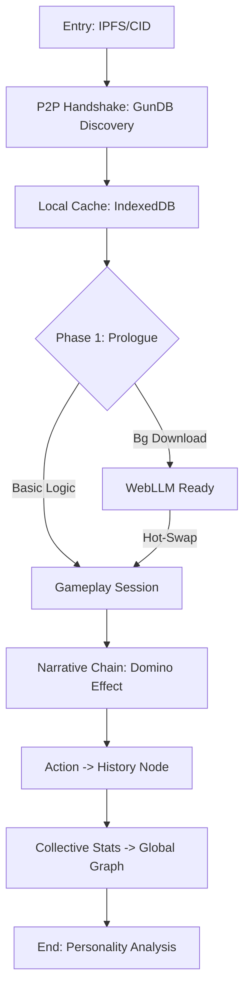

# 🏛️ Arsitektur VETO: Narrative-First & Zero-Friction

## 1. Filosofi Desain: Kecepatan & Kedalaman
Arsitektur JUSTICE CORE memprioritaskan **kecepatan akses (Zero-Friction)** dan **kedalaman narasi (Narrative-First)** di atas protokol konvensional. Sistem dirancang agar pengguna dapat langsung menduduki kursi kepemimpinan tanpa hambatan teknis yang berarti.

### Prinsip Utama:
*   **Instant-On Experience**: Menggunakan GunDB Global Graph untuk distribusi data P2P tanpa jabat tangan (handshake) yang membebani.
*   **Aggressive Caching**: Pemanfaatan IndexedDB secara agresif sehingga sesi berikutnya terasa instan.

---

## 2. Layer Arsitektur Lanjut (Impact & Intelligence)

### A. The Reality Engine (GunDB Master Graph)
*   **Dynamic Content Injection**: Memungkinkan penyuntikan skenario aktual secara *live* melalui Global Graph, menciptakan relevansi isu hukum yang sangat kuat bagi pemain.
*   **Collective Statistics**: Agregasi data anonim dari GunDB untuk memberikan umpan balik psikologis (misal: *"Keputusan Anda berbeda dari 90% pemimpin lainnya"*).

### B. The Intelligence Unit (On-Device reasoning)
*   **Local Processing**: Menggunakan **WebLLM** (AI lokal) untuk memproses analisis moral tanpa jeda waktu *buffering* cloud.
*   **Contextual Memory**: AI membaca seluruh sejarah keputusan yang tersimpan di GunDB lokal untuk menjaga konsistensi narasi (Long-term Impact).

---

## 3. Narrative Engine: The Domino Effect
Sistem tidak menggunakan pengacakan sederhana, melainkan **Linked-Graph Narrative** untuk menjamin konsekuensi yang logis.

### A. Struktur Linked-Node
Setiap keputusan akan memicu *logic tags* pada profil pemain (contoh: `tag: tegas_tapi_kejam` atau `tag: pro_rakyat`).
*   **Trigger System**: Skenario tertentu di GunDB hanya akan muncul jika syarat tag dan waktu (Day count) terpenuhi.

### B. Impact Feedback Loop
Siswa belajar melalui konsekuensi yang tertunda:
1.  **Action**: Pemain membuat keputusan di Hari ke-5.
2.  **Context**: AI mencatat keputusan ke *History Node*.
3.  **Reaction**: Dampak nyata muncul di Hari ke-25 berdasarkan data sejarah tersebut.

---

## 4. Alur Data & Performa (Technical Stack)

| Komponen | Teknologi | Tujuan Utama |
| :--- | :--- | :--- |
| **Narrative Fetcher** | GunDB Subscription (`.on`) | Memastikan kartu berikutnya sudah siap di memori (Pre-fetching). |
| **Story Validation** | Heuristic Engine | Validasi aturan hukum secara instan tanpa beban AI. |
| **On-Device Analysis**| WebLLM (Phi-3-mini) | Memberikan umpan balik emosional dan analisis kepribadian mendalam. |
| **Frontend State** | RAM-First Logic | Logika permainan berjalan 100% di memori selama sesi aktif. |

---

## 5. Strategi Inisialisasi: "Instant Play" Protocol

Arsitektur menggunakan pendekatan bertahap untuk mencapai latensi nol:

### Fase 1: The Prologue (Discovery)
Sambil pengguna membaca prolog, GunDB di latar belakang melakukan *discovery* ke *Relay Peers* untuk sinkronisasi grafik cerita terbaru. Logika awal menggunakan *Basic Heuristics* (If-Then) yang sangat ringan.

### Fase 2: Background Model Streaming (Adaptive)
Pengunduhan model AI dilakukan secara asinkron:
*   **Opportunistic Loading**: Hanya jika perangkat mendukung WebGPU dan koneksi stabil.
*   **Hot-Swap Upgrade**: Begitu siap, sistem beralih dari *Heuristics* sederhana ke *Deep Moral Analysis* tanpa mengganggu permainan.

---

## 6. Visualisasi Alur Arsitektur

---

## 7. Penutup (Summary)
Sistem ini mengawinkan transparansi Web 4.0 (P2P/IPFS) dengan kecepatan aplikasi *native*. Fokus utama tetap pada **Impact Emosional**, di mana teknologi bekerja diam-diam di latar belakang untuk mendukung narasi yang kuat.
