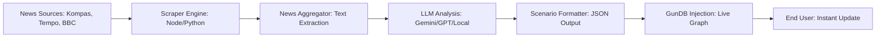

# 🌐 Concept: The Reality Scraper (Adaptive Narrative Engine)

Ide Anda untuk melakukan scraping berita otomatis dan mengubahnya menjadi skenario (JSON) adalah langkah menuju **Web 4.0 "Live Intelligence"**. Ini akan membuat **VETO** selalu relevan dengan isu dunia nyata.

---

## 🛠️ Arsitektur Sistem Scraper

## 1. Komponen Teknis
*   **Data Source**: Menggunakan RSS Feeds atau scraping langsung dari portal berita hukum/politik.
*   **Scenario Generator (AI)**:
    - Memberikan *context* kepada AI tentang 4 indikator kita: Law, Humanity, Order, Budget.
    - AI akan mengekstrak dilema dari berita tersebut.
*   **Validation**: Perlu satu tahap moderasi (Heuristic atau Human) sebelum disuntikkan ke Global Graph untuk memastikan akurasi data hukum.

## 2. Contoh Alur Otomatisasi
1.  **Input**: Berita tentang "Pengesahan RUU baru pagi ini".
2.  **Proses**: AI membuat skenario: "Rakyat demo karena RUU baru dirasa merugikan buruh. Apakah Anda tetap menandatanganinya?".
3.  **Output**: File JSON yang siap di-*deploy* ke GunDB secara otomatis.

## 3. Strategi Implementasi (Fase Lanjutan)
Kita bisa menggunakan **GitHub Actions** atau **Vercel Cron Jobs** untuk menjalankan skrip scraper ini setiap 24 jam.

> [!NOTE]
> **Professor S3 Advice**: "Efek kejut (Surprise Factor) bagi siswa ketika mereka melihat berita pagi ini sudah ada di dalam game siang ini adalah WOW factor yang akan membuat VETO viral di kalangan akademisi."
